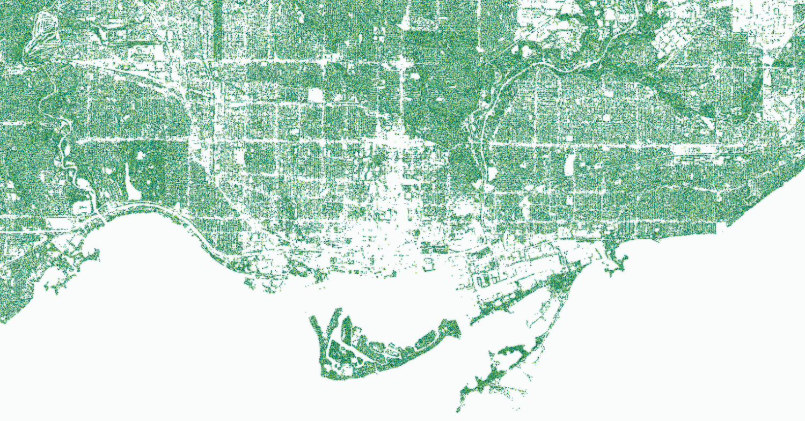

Mapping ~1.25 million trees in Toronto, basically as a test rendering 'big' datasets in browser with [tippecanoe](https://github.com/felt/tippecanoe), [PMTiles](https://github.com/protomaps/PMTiles), and [MapLibre](https://maplibre.org/). Data from [City of Toronto](https://open.toronto.ca/dataset/topographic-mapping-physical-location-of-trees/).

https://schoolofcities.github.io/trees-toronto/dot-map

